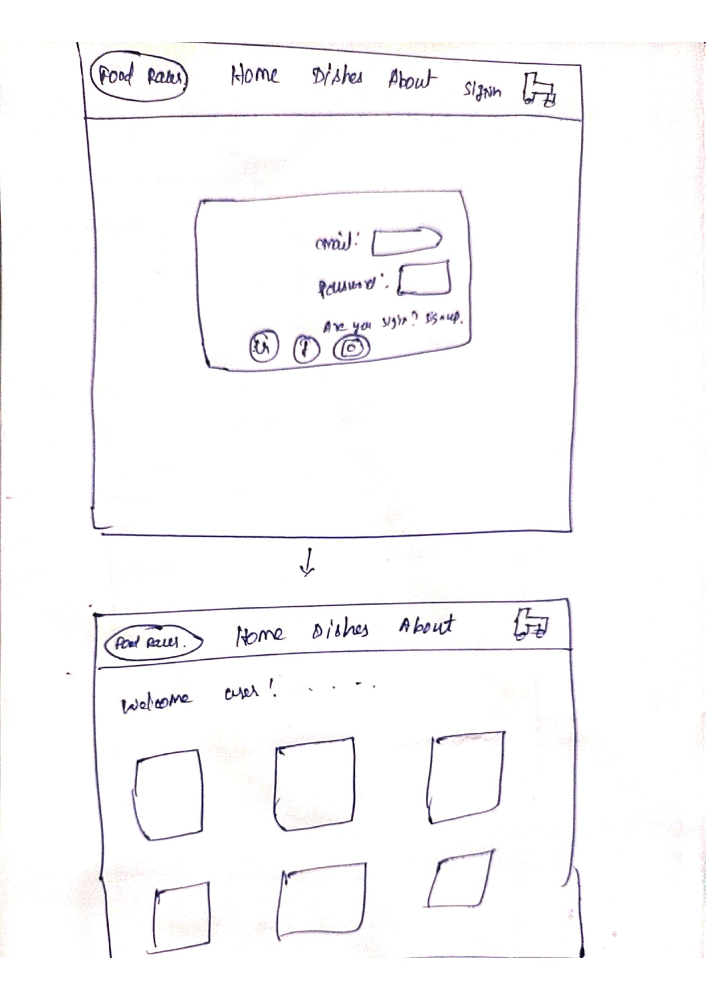
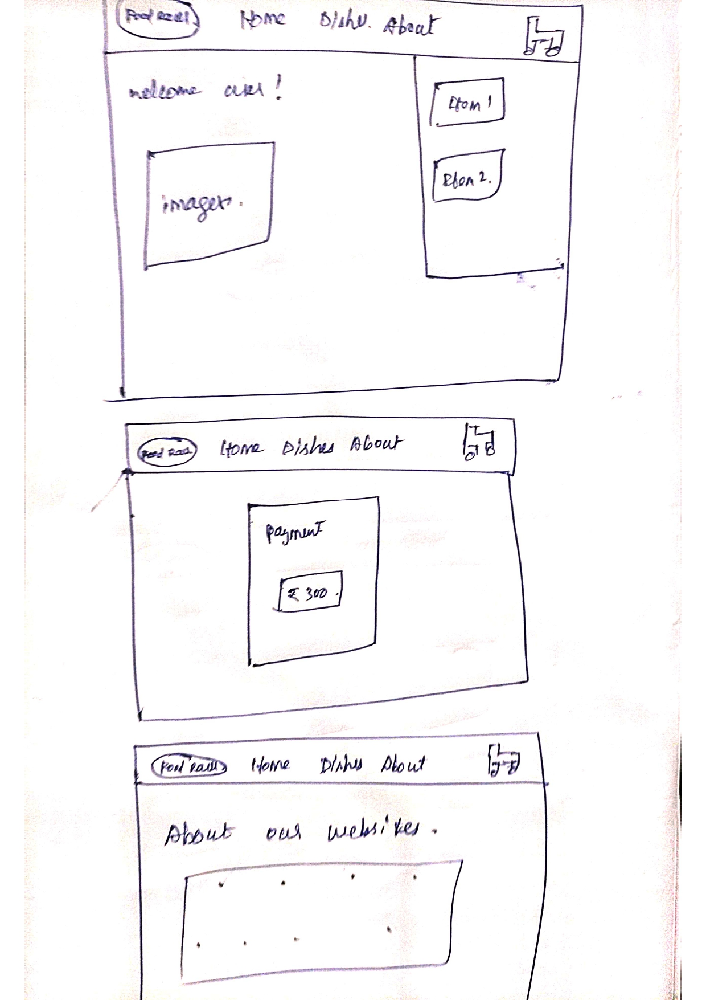

# Food-Adelivery-App

# Overview
This food delivery app will be designed specifically for a single shop, enabling customers to browse the menu, place orders, and track deliveries efficiently. The app will include essential features such as user authentication, order management, payment integration, and real-time order tracking.

# Project Objective
1. Provide a Seamless Ordering Experience  Allow customers to browse the menu, customize orders. 
    
1. Improve Order Management  Streamline order processing for the shop with automated notifications and real-time updates. 
1. Enhance Delivery Tracking  Provide real-time tracking of orders for both customers and delivery personnel.

# process and flow
1. Home
    1. About
    1. Dishes
    1. Cart
    1. Payment
    1. Delivery and Process

# Tech - Stack
1. Frontend
    1. React
    1. Tailwind Css
1. Backend
    1. Node,js+Express.js
1. Database
    1. MongoDb && MongoAtlas

## layout

